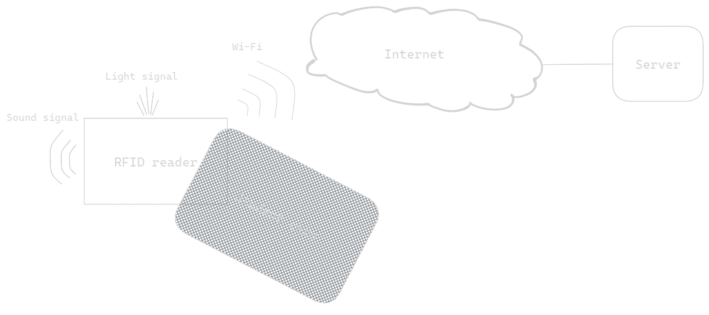
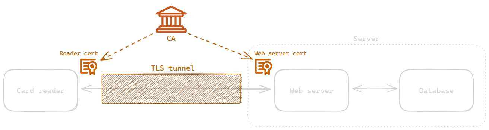
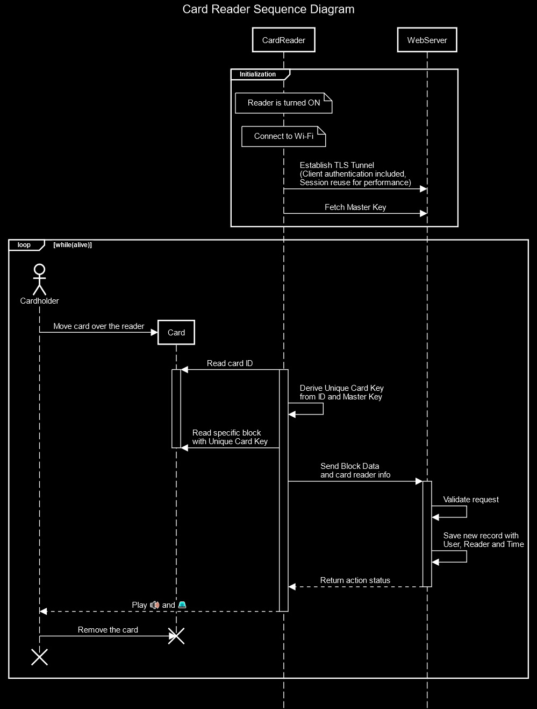
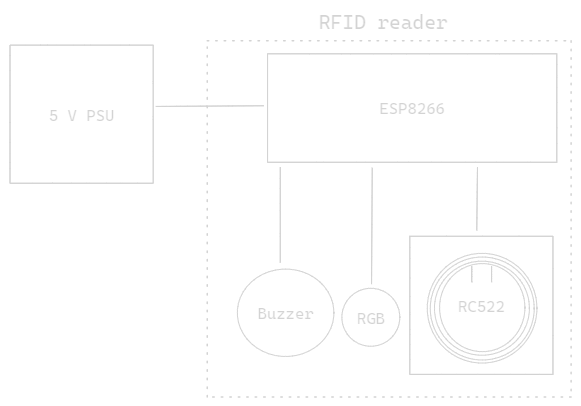
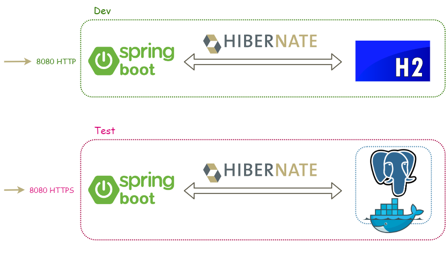
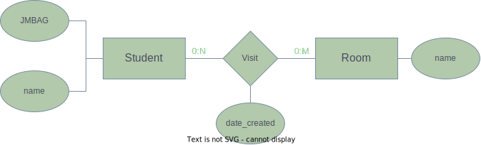
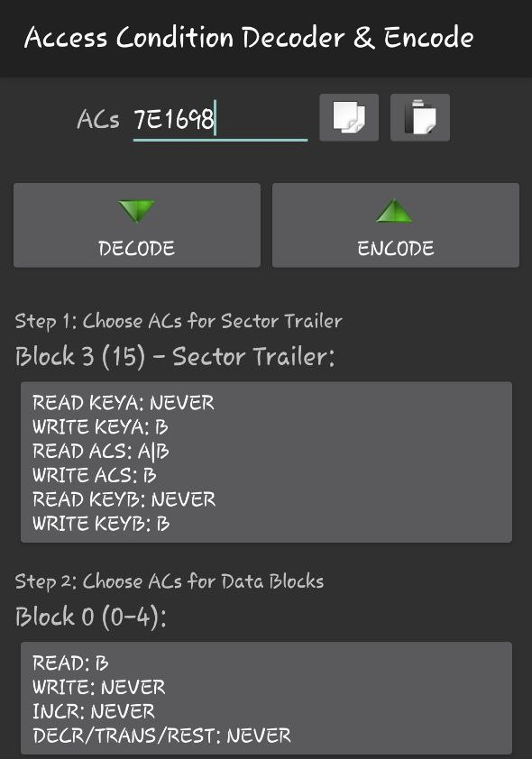
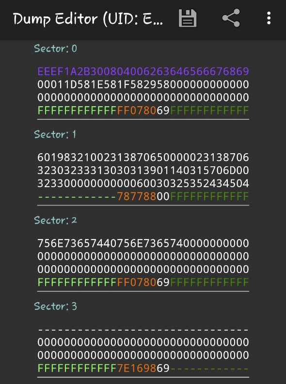
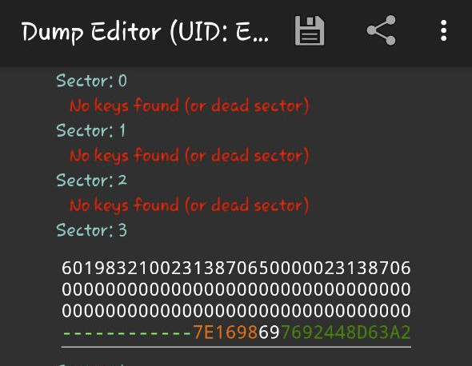

# Attendance monitoring system

**E2E Attendance System using ESP8266, MFRC522 RFID Reader, and ISO-14443A Tags with Server-Side Integration.**

Use Case: Student attendance in lectures is recorded by scanning student ID cards with an RFID reader in the classroom.

Some existing approaches use the card's UID, which can be modified on certain types of tags ("Magic" RFID Cards), allowing students to easily "clone" cards and appear present without attending. Another common approach involves reading a specific block on the card using a shared secret key. However, once one card's key is cracked, all cards using the same key are compromised.

In this implementation, the second approach is enhanced by assigning a unique key to each card, providing a higher level of security.

- [Presentation](./documentation/AttendanceMonitoringSystem.pdf)

## Main Concept

  

---
- [Mutual TLS](https://www.cloudflare.com/learning/access-management/what-is-mutual-tls/)

  

## Recording attendance sequence diagram

  

1. Init steps (executed only when reader is turned ON)
    1. Card reader and web server establish TLS tunnel (client authentication included), session is reused to improve performance
    2. Card reader fetches the master key from web server
2. Reading steps (Executed on each card read)
    1. Card ID is read and unique card key is derived from ID and master key
    2. Reader attempts to read specific block with derived key as Key B
    3. If block is read, reader sends block data to the server 
    4. Server tries to find user and if found server saves new record with user, reader and time info
    5. If successful, server responds to the reader with success code
    6. Reader waits for the response and if success, plays OK sound and green light

## RFID Reader
- [./esp8266](esp8266) : Card reader arduino code

  

  RFID Reader components

## Server side
- [./attendance-monitoring-system](attendance-monitoring-system) : Backend code

### Development and environments 
Spring Boot RESTful web service with JPA ORM (Hibernate) and H2 in development and Postgres in test profile.

  

### ER diagram
The following ER diagram is implemented. Student attendance is recorded through a relationship between the Student and Room entities (Visit), which also stores the time of the visit.

  

## Requirements
- NFC-enabled mobile devices with [MIFARE Classic Tool apk](https://play.google.com/store/apps/details?id=de.syss.MifareClassicTool&hl=en)
- Java 21, Maven
- Visual Studio Code
  - PlatformIO extension
- Router or mobile hotspot
- optional:
  - IntelliJ
  - Docker (if you want to use Postregs DB instead H2)
- Electronics
  - ESP8266
  - RC522 (working one)
  - Buzzer
  - RGB LED
  - ISO-14443A tag (usually comes with RC522)

## Get started

### 1. Setting up tag(s)

Tags are set up with [MIFARE Classic Tool](https://play.google.com/store/apps/details?id=de.syss.MifareClassicTool&hl=en) apk. Following steps explain procedure for single tag. This procedure can be easily automated with RC522.

1. Write at sector 3, and block 0 user 16 B secret (e.g. 60198321002313870650000023138706)
2. At sector 3, overwrite key B with 6 B key with value of `HKDF(master key, tag UID)`
3. Alter Access bits (block 0 at Sector 3 can be read only with Sector 3 key B). Access Conditions were generated using MIFARE Classic Tool apk. Another approach is to manually calculate bits using tag documentation.

  

  Defining ACs

#### Test tag(s)

Card reading attempt with default keys, after procedure. As we can see, Sector 3, Block 0 cannot be read, neither Key B.

  

  Accessing Sector 3 Block 1 with key A

Image on the right presents card reading attempt with Sector 3, Key B, after procedure. As we can see, key can only read Sector 3, because none of other sectors uses that key.

  

  Accessing Sector 3 Block 1 with key B

### 2. Starting the system
1. Connect the server to the Internet
2. Get server IP address
3. Insert server IP address and Wi-Fi credentials [here](./src/client/client.h).
4. Upload code to the ESP8266
5. Run the Spring boot application
6. Open [H2 Console](http://localhost:8080/h2-console/) and test tag reading!

# References

- [Tutorial: how an RFID 13.56 Mhz read/write ISO-14443A tag works.](https://www.puntoflotante.net/TUTORIAL-RFID-ISO-14443A-TAGS-13.56-MHZ.htm)
- [Tag Memory access](https://www.mouser.com/datasheet/2/302/MF1S503x-89574.pdf#page=11)
- [A 2018 practical guide to hacking NFC/RFID](https://smartlockpicking.com/slides/Confidence_A_2018_Practical_Guide_To_Hacking_RFID_NFC.pdf)
- [Security in NFC Readers](https://www.themobileknowledge.com/wp-content/uploads/2017/05/Security-in-NFC-Readers-Public.pdf)
- [Online tool for creating UML sequence diagrams](https://sequencediagram.org/)
